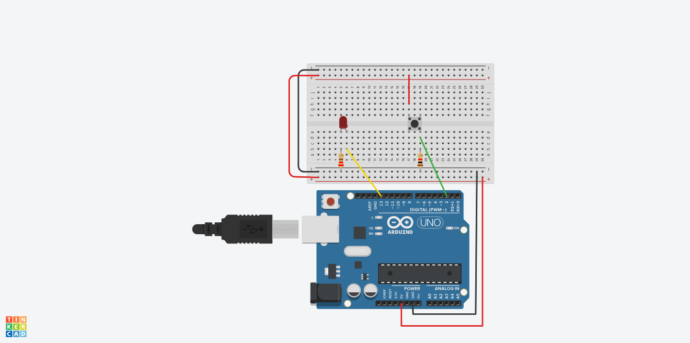

# Arduino Pushbutton LED Control

## Project Overview
This project demonstrates a simple digital input-output control using an Arduino. It involves a pushbutton that, when pressed, turns on a built-in LED on the Arduino board. This is a fundamental example of interfacing input devices (like buttons) with output devices (like LEDs) in the world of microcontrollers and electronics.

## Components
- Arduino (Uno, Mega, etc.)
- Pushbutton
- Breadboard (optional, for ease of wiring)
- Connecting wires

## Circuit Diagram

## Code Description
The Arduino sketch (`pushbutton_led_control.ino`) is written in C++. The code is structured into two main functions:
- `setup()`: Initializes pin 2 as input (connected to the pushbutton) and the built-in LED pin as output.
- `loop()`: Continuously reads the state of the pushbutton. If pressed, the LED turns on; otherwise, it remains off.

## Installation
1. Connect the components as per the circuit diagram.
2. Open the Arduino IDE on your computer.
3. Connect your Arduino board to your computer via USB.
4. Open `pushbutton_led_control.ino` in the Arduino IDE.
5. Select the correct board and port in the Arduino IDE.
6. Upload the code to your Arduino board.

## Usage
Press the pushbutton to turn the LED on. Releasing the button will turn the LED off.

## Contributing
Pull requests are welcome. For major changes, please open an issue first to discuss what you would like to change.

## License
[MIT](https://choosealicense.com/licenses/mit/)

